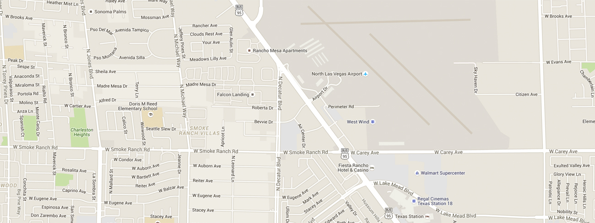

<!DOCTYPE html>

<html lang="en">
   
<head>
<meta name="description" content="">
<meta name="keywords" content=""> 
<meta name="viewport" content="width=device-width, initial-scale=1">
<title>::The Press::</title>
<link href="css/style.css" rel="stylesheet" type="text/css" />

  
<link href="css/jquery.bxslider.css" rel="stylesheet" />
<link href="css/font-awesome.css" rel="stylesheet" type="text/css" />

</head>

<body>
<header id="header">
	   

	   <nav class="menu">
	       <ul>
		       <li><a href="#header">Home</a></li>
			   <li><a href="#process">Process</a></li>
			   <li><a href="#order">Order</a></li>
			   <li><a href="#contact-sec">Contact</a></li>
			   

		   </ul>
	   </nav>
	   <ul class="bxslider">
<li>
   
   

Picking da juice

</li>
<li>
    
	

time for da juice

</li>
</ul>
</header>

<a class="button" href="subscribe-form.html">Subscribe</a>

<section id="process">
      <h1>the process</h1>
	  

	      

		      
		  

		  

		  

		      step 1
			  <h3>PICKING THE FRUIT</h3>
			  
This is the first step to making the perfect juice. We carefully choose the right farms and farmers to handpick us the right fruits that are in season.

		  

		  
		  

		  

		      
		  

		  

	   

	   

		  

		  

		      step 2
			  <h3>JUICING</h3>
			  
We use the best juicing machine and deliver our products from national to international continents. From having the best produce and juicing machines in the world, it makes our product the #1 choice to choose from.

		  

		  
		  

		  

		      
		  

		  

		  

		      step 3
			  <h3>PACKAGING</h3>
			  
Packaging might seem like one easy task, but here at The Press, we make sure that our packing is strong enough to withhold any type of damage that may occur. Oh, and did we mention how COOL our custom made bottles are?!

	      

		  
		  

		  

	   

	   

		  

		      
		  

		  

		  

		      step 4
			  <h3>THE DELIVERY</h3>
			  
After steps 1-3 are finished, it is now time for the best part...DELIVERY! And no, that cool looking truck the right is not our current delivery truck, unfortunately. But we still get it to you with 1-3 business days nationally and 3-7 days internationally - yes and thank you...we know that is fast.

		  

		  
		  

		  

		      
		  

		  

	  

	  

	      
		  

We want you to enjoy our service.--So check out how to order below--

	  

	  
<a class="button" href="order-form.html">Order Now</a>

</section>
<section id="order">
     

	    

		

		     <h2>WE AREMOBILE FRIENDLY</h2>
			 
Yes, we are in 2015, so being mobile friendly is one of our biggest business models, which is to always keep our buesiness mobile friendly. By doing so this makes it accessible to you 24/7 wherever you may be. Our job is to make ordering easier and efficient for you.

	     

		 
		 

	     

		     
		 

		 

	 

	 

	    

		     
		 

		 

		 

		     <h2>WE AREDESKTOP FRIENDLY</h2>
			 
We are also desktop friendly, so you are able to use a computer from anywhere and still be able to order our deliciously pre-pressed juice, that has been ranked #1 fo the last three years in a row.

		 

		 
		 

		 

	 

	 
<a class="button" href="order-form.html">Order Now</a>

</section>
<section id="contact-sec">
       <h1>contact us</h1>
	   

	       

		   <label>Name</label>
		   <input type="text" name="name" placeholder="Name" />
		   

		   

		   

		   <label>Email</label>
		   <input type="text" name="email" placeholder="Email" />
		   

		   

		   

		   <label>Subject</label>
		   <input type="text" name="subject" placeholder="Subject" />
		   

		   

		   

		   <label>Message</label>
		   <textarea name="message" placeholder="Message"></textarea>
		   

		   

		   

		   <input class="button" type="submit" name="submit" value="Submit" />
		   

		   

	   

	   

</section>
<footer id="footer">
    

    <ul class="social">
	   <li><a href=""><i class="fa fa-facebook"></i></a></li>
	   <li><a href=""><i class="fa fa-instagram"></i></a></li>
	   <li><a href=""><i class="fa fa-twitter"></i></a></li>
	</ul>
	
&copy; 2015 The Press, LLC. All rights reserved.

</body>

</html>
